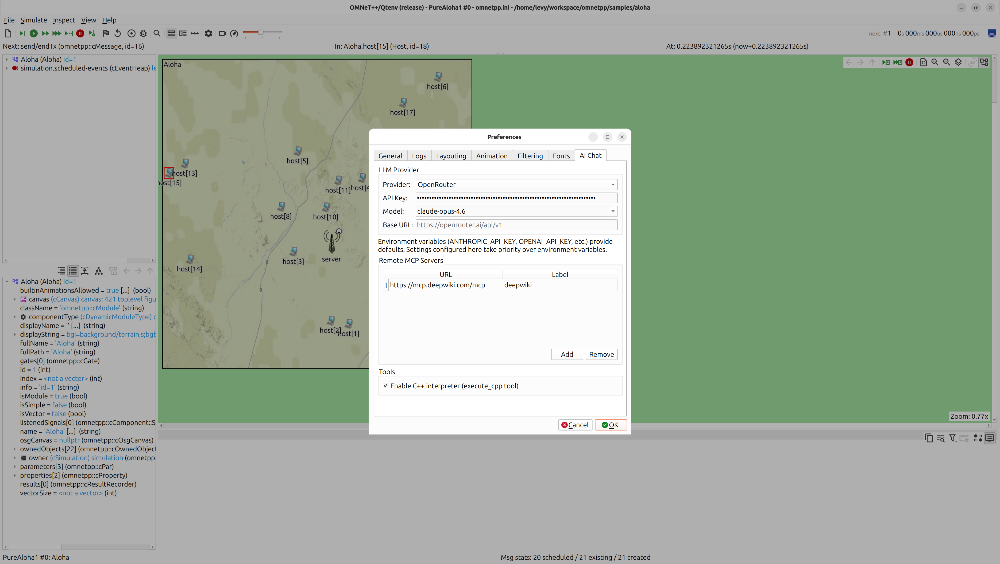
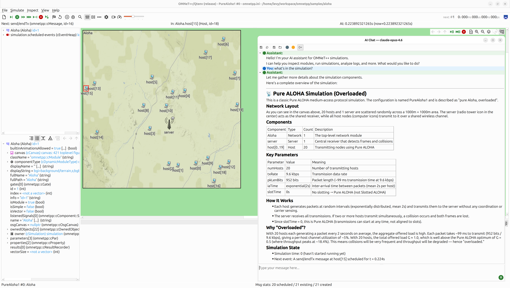
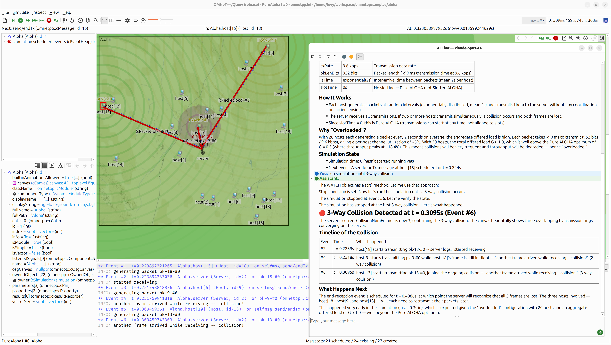

This walkthrough demonstrates the **AI Chat Assistant** — an LLM-powered
chat window inside OMNeT++ Qtenv that can inspect and control a running
simulation through natural language. We use the classic Aloha sample to
show how a single sentence ("run simulation until 3-way collision") leads
the AI to set a programmable stop condition and find the exact event.

## Setup

We start the Aloha sample inside `opp_sandbox`:

```bash
cd samples/aloha
opp_sandbox ./aloha
```

> **Note:** The `opp_sandbox` wrapper runs the simulation inside a lightweight Linux sandbox (using [bubblewrap](https://github.com/containers/bubblewrap)). This is needed because the AI assistant has an `execute_cpp` tool that JIT-compiles and runs arbitrary C++ code inside the simulation process — extremely powerful, but potentially dangerous on an unprotected system. The sandbox restricts filesystem write access to only the working directory, drops all capabilities, and isolates namespaces, so even if the AI generates harmful code, it cannot affect the host system. The C++ interpreter is automatically disabled when not running inside the sandbox.

After selecting the *PureAloha1* configuration in Qtenv, we configure the
LLM provider in **Edit → Preferences → AI Chat** (the API key, model, and
provider are set here — the same settings can also be provided via
environment variables like `ANTHROPIC_API_KEY`, but the Preferences dialog
takes priority):

{: .materialboxed width="700px"}

Then we open the chat window from **Inspect → AI Chat Assistant** and start
asking questions.

> **Note:** The results you receive are highly dependent on the LLM provider and model you are using. The results shown in this demo are based on the Claude Opus 4.6 model.

## Step 1: "What's in the simulation?"

We type a simple question:

> **You:** what's in the simulation?

The AI calls several tools behind the scenes (`get_module_info`,
`get_simulation_state`, `get_module_parameters`, `get_canvas_image`) to
gather information about the network, and responds with a structured
overview:

> **Assistant:**
>
> ### Pure ALOHA Simulation (Overloaded)
>
> This is a classic Pure ALOHA medium-access protocol simulation. The
> configuration is named PureAloha1 and is described as "pure Aloha,
> overloaded".
>
> | Component    | Type    | Count | Description                                         |
> |-------------|---------|-------|-----------------------------------------------------|
> | Aloha        | Network | 1     | The top-level network module                        |
> | server       | Server  | 1     | Central receiver that detects frames and collisions |
> | host[0..19] | Host    | 20    | Transmitting nodes using Pure ALOHA                 |
>
> | Parameter | Value           | Meaning                                               |
> |-----------|-----------------|-------------------------------------------------------|
> | numHosts  | 20              | Number of transmitting hosts                          |
> | txRate    | 9.6 kbps        | Transmission data rate                                |
> | pkLenBits | 952 bits        | Packet length (~99 ms transmission time at 9.6 kbps)  |
> | iaTime    | exponential(2s) | Inter-arrival time between packets (mean 2s per host) |
> | slotTime  | 0s              | No slotting → Pure ALOHA (not Slotted ALOHA)          |
>
> ### Why "Overloaded"?
>
> With 20 hosts each generating a packet every 2 seconds on average, the
> total offered load G ≈ 1.0, which is well above the Pure ALOHA optimum
> of G = 0.5. This means collisions will be very frequent.

The AI already understands the model structure, the protocol, and even
explains *why* this configuration is called "overloaded" — all from
inspecting the parameters.

{: .materialboxed width="700px"}

## Step 2: "Run simulation until 3-way collision"

Now we ask something more demanding:

> **You:** run simulation until 3-way collision

This is where it gets interesting. The AI cannot simply click "Run" — it
needs to figure out *how* to detect a 3-way collision, write a stop
condition, and then run the simulation.

### How the AI approaches this

**1. Inspect the server's internal state.** The AI first calls
`get_module_watches` on `Aloha.server` and discovers a WATCH variable:

```
watches:
  - name: currentCollisionNumFrames
    className: long
    value: 0
```

This variable tracks how many frames are involved in the current collision.
A 3-way collision means this value reaches 3.

**2. Set a programmable stop condition.** The AI calls the
`set_stop_condition` tool with a C++ condition. This is the key mechanism:
the tool accepts the *body* of a C++ lambda with signature
`[](cEvent *event) -> bool { ... }`. The simulation evaluates this
condition before each event and stops when it returns `true`.

The AI writes the following condition:

```cpp
// Stop condition body — evaluated before each event
auto *server = getSimulation()->getModuleByPath("Aloha.server");
if (!server) return false;
cObject *watch = server->findObject("currentCollisionNumFrames");
if (!watch) return false;
std::string val = watch->str();
return val == "3";
```

The condition navigates the module tree to find the server, locates the
WATCH object by name, reads its string representation, and checks if it
equals "3". This is compiled by the JIT C++ interpreter and installed as a
stop condition. Once set, the condition remains active — if the simulation
stops and the user presses Run again, the condition will trigger again at
the next 3-way collision.

**3. Run the simulation.** With the stop condition in place, the AI calls
`run_simulation` with no time or event limit — the simulation runs freely
until the condition triggers.

**4. Verify and report.** After the simulation stops, the AI calls
`get_module_watches` to confirm the value is 3, `get_module_log` to read
the server's event log, and `get_canvas_image` to capture the visual state.

### The result

> **Assistant:**
>
> ### 3-Way Collision Detected at t = 0.3095s (Event #6)
>
> The server's `currentCollisionNumFrames` is now 3, confirming the 3-way
> collision. The canvas shows three overlapping transmission rings converging
> on the server.
>
> | Event | Time        | What happened                                                    |
> |-------|-------------|------------------------------------------------------------------|
> | #2    | t = 0.2239s | host[18] starts transmitting → server: "started receiving"       |
> | #4    | t = 0.2518s | host[9] starts transmitting → "collision!" (2-way)               |
> | #6    | t = 0.3095s | host[13] starts transmitting → "collision!" (3-way)              |
>
> This happened very early in the simulation (just ~0.3s in), which is
> expected given the "overloaded" configuration with an aggregate offered
> load of G ≈ 1.0.

{: .materialboxed width="700px"}

Notice that the simulation stopped at the exact moment when the wavefront
of the third signal (from host[13]) reached the server — you can see three
transmission rings converging on the server in the screenshot, with the
third one just arriving. This is because the stop condition is evaluated
before each event, so the simulation halts right at Event #6 where the
server detects the third overlapping frame and increments
`currentCollisionNumFrames` to 3.

The detailed timeline with event numbers, exact timestamps, and which hosts
were involved was also extracted automatically — the AI read the server's
event log, identified the relevant entries, and presented them in the table
above. No manual log searching required.

## What just happened under the hood

The entire interaction — from "run simulation until 3-way collision" to the
detailed collision report — was driven by the AI making tool calls
autonomously:

1. `get_module_watches` — discover observable state
2. `set_stop_condition` — install a JIT-compiled C++ condition
3. `run_simulation` — advance the simulation until the condition triggers
4. `get_module_watches` — verify the stop condition fired correctly
5. `get_module_log` — retrieve the event log for the timeline
6. `get_canvas_image` — capture the visual state

The user typed one sentence. The AI figured out *what* to look for, *how*
to detect it in C++, and presented the results with a clear timeline.

## Summary

- **Natural language control.** You describe *what* you want ("run until
  3-way collision"), not *how* to get there. The AI translates intent into
  tool calls.
- **Programmable stop conditions.** The `set_stop_condition` tool accepts
  arbitrary C++ code that runs inside the simulation process. The AI writes
  this code for you based on your description.
- **Rich context.** The AI combines multiple tools (topology, parameters,
  logs, canvas images, watches) to build a complete picture and present it
  clearly.
- **Tool visibility.** Click the **Tools** button in the toolbar to see or
  hide the individual tool calls. Visible mode is great for understanding
  what the AI is doing; hidden mode gives a clean chat experience.
