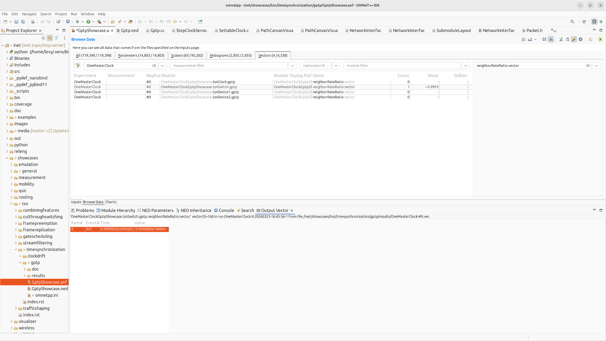
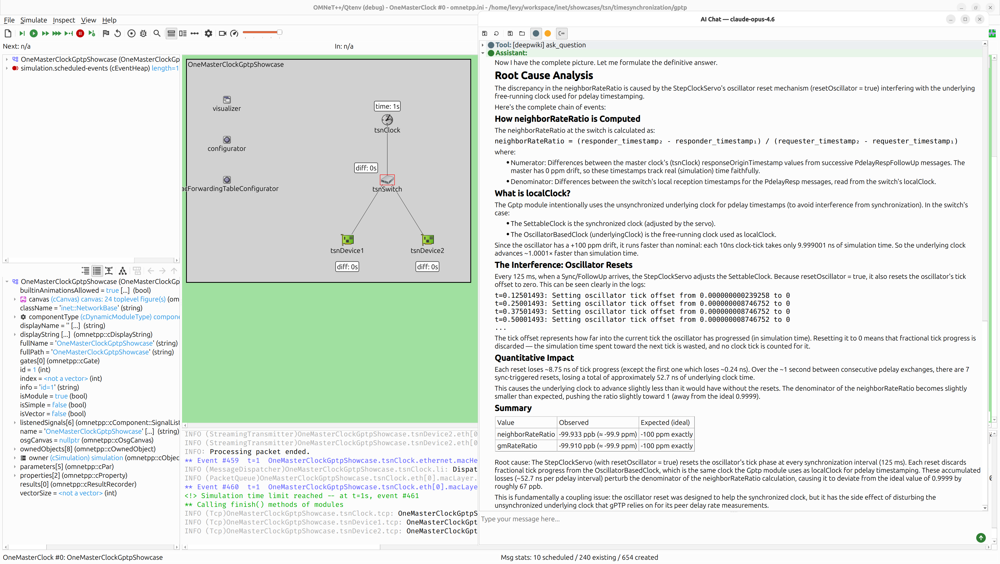

This walkthrough demonstrates the **AI Chat Assistant** tackling a subtle
timing anomaly in an IEEE 802.1AS (gPTP) clock synchronization simulation.
The user observes that the switch's `neighborRateRatio` — a value that
should reflect only the configured oscillator drift — deviates slightly
from the expected value. The AI systematically investigates the gPTP
protocol state, consults external documentation, runs C++ calculations
inside the simulation, and ultimately identifies a non-obvious coupling
between the clock servo's oscillator reset mechanism and the
free-running clock used for peer delay measurements.

> **Note:** The results you receive are highly dependent on the LLM provider and model you are using. The results shown in this demo are based on the Claude Opus 4.6 model.

## Setup

We launch the INET showcase inside `opp_sandbox` so that the AI
assistant's `execute_cpp` tool (JIT C++ interpreter) is available:

```bash
cd showcases/tsn/timesynchronization/gptp
opp_sandbox -m $INET_ROOT -- `inet_dbg -p`
```

> **Note:** The `-m $INET_ROOT` flag mounts the INET installation
> directory into the sandbox (needed for headers and libraries), and
> `` `inet_dbg -p` `` expands to the necessary include paths for the C++
> interpreter. Without `opp_sandbox`, the C++ interpreter is
> automatically disabled for safety.

After selecting the *OneMasterClock* configuration in Qtenv, we configure
the LLM provider in **Edit → Preferences → AI Chat** and open the chat
window from **Inspect → AI Chat Assistant**.

## Background: gPTP Terminology

IEEE 802.1AS (gPTP) is the time synchronization protocol used in TSN
networks. A few key concepts are needed to follow this showcase:

- **Oscillator and clock drift.** Each network device has a local
  oscillator that drives its clock. Real oscillators are never perfectly
  accurate — they run slightly faster or slower than nominal, expressed
  in parts per million (ppm). A drift of +100 ppm means the clock gains
  ~100 µs per second.
- **neighborRateRatio.** A value computed by gPTP that measures how fast
  a neighbor's clock runs relative to the local clock. It is derived from
  periodic *peer delay* (Pdelay) message exchanges between adjacent nodes.
  For a node with +100 ppm drift relative to its neighbor, the expected
  value is 0.9999.
- **SettableClock vs. free-running clock.** INET models two clock layers:
  the *SettableClock* (adjusted by synchronization) and the underlying
  *OscillatorBasedClock* (free-running, affected only by drift). The gPTP
  module deliberately uses the free-running clock for Pdelay timestamping
  to avoid circular interference with synchronization.
- **Clock servo.** The component that adjusts the synchronized clock based
  on gPTP measurements. The *StepClockServo* applies immediate corrections
  and can optionally reset the oscillator's phase at each adjustment.

## The Scenario

The simulation is INET's gPTP time synchronization showcase (*OneMasterClock*
configuration) — a small TSN
network with a master clock (`tsnClock`), a bridge (`tsnSwitch`), and two
slave devices. The switch's oscillator has a configured drift of +100 ppm;
all other oscillators have zero drift. The gPTP protocol synchronizes the
switch's clock to the master, and as part of this process computes the
`neighborRateRatio`.

To isolate the issue, the default parameterization of this showcase
has been simplified. The original
configuration uses `RandomDriftOscillator` with varying drift rates,
which would make the anomaly hard to spot. The modified `omnetpp.ini`
replaces all oscillators with
`ConstantDriftOscillator`, sets the switch's drift to exactly +100 ppm,
and sets all other oscillators to 0 ppm:

```ini
# Original: random drift oscillators with varying rates
-**.tsnClock*.clock.oscillator.typename = "RandomDriftOscillator"
-**.oscillator.driftRate = uniform(-100ppm, 100ppm)
-**.oscillator.driftRateChange = uniform(-1ppm, 1ppm)

# Modified: deterministic constant drift, only on the switch
+**.oscillator.typename = "ConstantDriftOscillator"
+**.tsnSwitch.clock.oscillator.driftRate = 100ppm
+**.oscillator.driftRate = 0ppm
```

With this setup, the user expects the switch's `neighborRateRatio` to be
exactly 0.9999 (corresponding to the 100 ppm drift), but observes
0.999900067 instead — a ~67 ppb discrepancy. Something is interfering.

After running the simulation, the user opens the **Browse Data** tab in
the OMNeT++ IDE and filters for the `neighborRateRatio` result vector.
The recorded mean value is clearly not the expected −100 ppm — this is
the observation that triggers the investigation:

{: .materialboxed width="700px"}

The user switches to the AI Chat window and asks the assistant to
investigate. By the end of the conversation, the AI has traced the
anomaly to its root cause:

{: .materialboxed width="700px"}

## Step 1: The User's Question

> **You:** All oscillators have zero drift, except for the oscillator
> in the switch, which has a drift of 100 ppm. Based on that, I would
> expect the switch's neighborRateRatio to be exactly 0.9999,
> corresponding to the configured clock drift. However, that is not
> what I observe. I suspect that some part of the clock synchronization
> process is influencing the neighborRateRatio calculation. Can you
> determine what interferes with it and identify the root cause?

This is a hard question — it requires understanding the gPTP protocol,
the clock model hierarchy (SettableClock vs. OscillatorBasedClock), and
how the clock servo interacts with the oscillator. The AI begins a
systematic investigation.

## Step 2: Surveying the Simulation State

The AI starts by discovering the network structure and examining the gPTP
module's internal state. After navigating the module hierarchy with
`get_module_hierarchy`, it calls `get_module_watches` on the switch's
gPTP module and immediately spots the anomaly:

```
watches:
  - name: gmRateRatio
    value: NumberNear1 {x ≈ 0.999900089983008944, ppm ≈ -100, ppb ≈ -99910}
  - name: neighborRateRatio
    value: NumberNear1 {x ≈ 0.999900067488942335, ppm ≈ -100, ppb ≈ -99933}
  - name: pdelay
    value: 0.000000049967522
```

> **Assistant:** Interesting! The neighborRateRatio is approximately
> 0.999900067 instead of exactly 0.9999. Let me also look at the master
> clock's gPTP and the oscillator parameters.

The AI then inspects the oscillator configuration and confirms the
setup — the switch has a `ConstantDriftOscillator` with `driftRate = 100ppm`,
`nominalTickLength = 10ns`, and `currentTickLength = 9.999001ns` (the tick
period shortened because the oscillator runs fast). It also checks the
master clock's gPTP watches and confirms its `neighborRateRatio` is
exactly 1.0 — as expected for a node with no drift.

### Tools used so far

| Tool | Purpose |
|------|---------|
| `get_simulation_state` | Check simulation phase (finished at t=1s) |
| `get_module_hierarchy` | Discover gPTP, clock, and oscillator submodules |
| `get_module_parameters` | Read gPTP config (pdelayInterval=1s, syncInterval=125ms) |
| `get_module_watches` | Read neighborRateRatio, gmRateRatio, pdelay, oscillator state |
| `get_module_info` | Confirm module types (Gptp, ConstantDriftOscillator, SettableClock) |

## Step 3: Understanding the Protocol via DeepWiki

To understand *how* `neighborRateRatio` is computed, the AI queries the
DeepWiki MCP server — an external knowledge base that provides
AI-powered documentation for the INET Framework GitHub repository:

> **Tool call:** `[deepwiki] ask_question`
>
> *"How is neighborRateRatio calculated in the Gptp module? Show me the
> relevant C++ code, especially how pdelay request/response timestamps
> are used."*

DeepWiki explains that the ratio is computed from successive PdelayResp
exchanges:

```cpp
neighborRateRatio = ClockTimeScale::fromRatio(
    correctedResponderEventTimestampDifference,
    pdelayRespEventIngressTimestampDifference);
```

The numerator comes from the master's timestamps (in the
PdelayRespFollowUp message), and the denominator comes from the switch's
local clock readings when PdelayResp is received.

The AI then asks a critical follow-up question:

> **Tool call:** `[deepwiki] ask_question`
>
> *"In the Gptp module, what is `localClock`? Is it the SettableClock or
> the underlying free-running OscillatorBasedClock?"*

The answer reveals the key architectural detail:

> The `localClock` is initialized by checking if the clock is a
> `SettableClock`. If so, `localClock` is assigned the result of
> `settableClock->getUnderlyingClock()` — the free-running
> `OscillatorBasedClock`.

```cpp
auto settableClock = dynamic_cast<SettableClock *>(clock.get());
localClock = settableClock != nullptr
    ? settableClock->getUnderlyingClock() : clock;
```

> **Assistant:** This is very important! The localClock for the switch is
> the underlying OscillatorBasedClock, not the SettableClock. Now let me
> understand what happens to the pdelay timestamps. The switch's
> localClock is the OscillatorBasedClock, which is affected by the drift
> but also affected by the frequency compensation applied by the clock
> servo.

## Step 4: Finding the Smoking Gun in the Logs

The AI retrieves the switch's gPTP event log using `get_module_log` and
traces the exact sequence of events. It finds that every 125 ms, when
a Sync/FollowUp arrives, the StepClockServo resets the oscillator:

```
t=0.12501493: Setting oscillator tick offset from 0.000000000239258 to 0
t=0.25001493: Setting oscillator tick offset from 0.000000008746752 to 0
t=0.37501493: Setting oscillator tick offset from 0.000000008746752 to 0
t=0.50001493: Setting oscillator tick offset from 0.000000008746752 to 0
...
```

The tick offset represents how far the oscillator has progressed into its
current tick (in simulation time). Setting it to zero means that
fractional tick progress is **discarded** — the simulation time spent
toward the next tick is wasted, and no clock tick is counted for it.

A third DeepWiki query confirms the mechanism:

> **Tool call:** `[deepwiki] ask_question`
>
> *"In the StepClockServo, what does resetOscillator do? Show me the code
> for adjustClockForDifference."*

The response confirms that `resetOscillator = true` causes the
oscillator's phase/origin to be reset at each synchronization, restarting
its duty cycle.

## Step 5: Numerical Verification with `execute_cpp`

To confirm the hypothesis quantitatively, the AI uses the `execute_cpp`
tool — a JIT C++ interpreter running inside the simulation process — to
calculate the expected impact of the oscillator resets:

> **Tool call:** `[simulation] execute_cpp`
>
> The AI writes a C++ program that:
> 1. Computes the clock-time lost at each oscillator reset (converting
>    sim-time tick offsets to clock-time)
> 2. Sums the losses across all 7 sync events between pdelay exchanges
> 3. Calculates the modified neighborRateRatio accounting for the losses

```
Total underlying clock time lost between pdelay exchanges: 52.72 ns

Ideal neighborRateRatio (no resets): 0.999900100000000069
Modified neighborRateRatio:          0.999900152714506163
Observed neighborRateRatio:          0.999900067488942335

Difference from ideal: 52.71 ppb
```

> **Assistant:** The direction and order of magnitude match. My
> calculation is approximate because I'm not accounting for the precise
> sim-time intervals and the exact number of resets.

The approximate calculation predicts a shift in the right direction and
the right order of magnitude (~53 ppb predicted vs. ~67 ppb observed),
confirming the hypothesis. The remaining difference is due to
simplifications in the manual calculation.

## Step 6: The Root Cause Analysis

After gathering all the evidence, the AI delivers a definitive answer:

> **Assistant:**
>
> ### Root Cause
>
> The discrepancy in the neighborRateRatio is caused by the
> StepClockServo's oscillator reset mechanism (`resetOscillator = true`)
> interfering with the underlying free-running clock used for pdelay
> timestamping.
>
> Every 125 ms, when a Sync/FollowUp arrives, the StepClockServo resets
> the oscillator's tick offset to zero. This discards fractional tick
> progress from the OscillatorBasedClock — the same clock that the Gptp
> module uses as `localClock` for peer delay timestamping. Over the ~1
> second between pdelay exchanges, 7 resets accumulate approximately
> 52.7 ns of lost clock time, perturbing the denominator of the
> neighborRateRatio calculation.
>
> **This is fundamentally a coupling issue**: the oscillator reset was
> designed to help the synchronized clock, but it has the side effect of
> disturbing the unsynchronized underlying clock that gPTP relies on for
> its peer delay rate measurements.
>
> | Value | Observed | Expected (ideal) |
> |-------|----------|------------------|
> | neighborRateRatio | -99.933 ppb (≈ -99.9 ppm) | -100 ppm exactly |
> | gmRateRatio | -99.910 ppb (≈ -99.9 ppm) | -100 ppm exactly |

## What Happened Under the Hood

The entire investigation — from the user's question to the definitive
root cause — was driven by the AI autonomously orchestrating 20+ tool
calls across two different tool servers:

### Simulation tools (MCP Server — local)

| Tool | Calls | Purpose |
|------|-------|---------|
| `get_simulation_state` | 1 | Check simulation phase |
| `find_modules` | 4 | Search for gPTP and clock modules |
| `get_module_hierarchy` | 3 | Explore module tree structure |
| `get_module_parameters` | 4 | Read gPTP and oscillator configuration |
| `get_module_watches` | 6 | Inspect runtime state variables |
| `get_module_info` | 2 | Verify module types |
| `get_module_log` | 1 | Read the switch's gPTP event log |
| `list_result_files` | 1 | Check available result files |
| `execute_cpp` | 2 | Run numerical calculations in-process |

### External knowledge (DeepWiki MCP Server — remote)

| Tool | Calls | Purpose |
|------|-------|---------|
| `ask_question` | 3 | Query INET documentation for gPTP internals |

## Summary

- **A hard problem to analyze.** This is a subtle interaction between
  two subsystems (clock servo and pdelay timestamping) that are both
  individually correct but interfere when coupled through a shared
  oscillator. Tracing a 67 ppb anomaly to its root cause requires
  understanding the gPTP protocol, INET's clock architecture, and the
  servo's oscillator reset mechanism. The AI found it in a single
  conversation.

- **Multi-source investigation.** The AI seamlessly combined local
  simulation inspection tools with the remote DeepWiki knowledge base to
  understand both the *runtime state* (what the simulation produced) and
  the *source code semantics* (why it produced those values).

- **Quantitative verification.** Rather than stopping at a qualitative
  explanation, the AI used the `execute_cpp` tool to run a numerical
  calculation *inside the simulation process*, predicting a ~53 ppb shift
  that matches the observed ~67 ppb deviation in direction and order of
  magnitude.

- **Verifiable results.** The root cause analysis can be independently
  verified: disabling the oscillator reset (`resetOscillator = false` in
  the StepClockServo) should eliminate the discrepancy and produce a
  neighborRateRatio of exactly 0.9999.

- **Structured reasoning.** The investigation followed a clear logical
  chain: observe the anomaly → understand the computation → identify
  which clock is used → discover how it's perturbed → quantify the
  effect → deliver the root cause. Each step built on the previous one.
